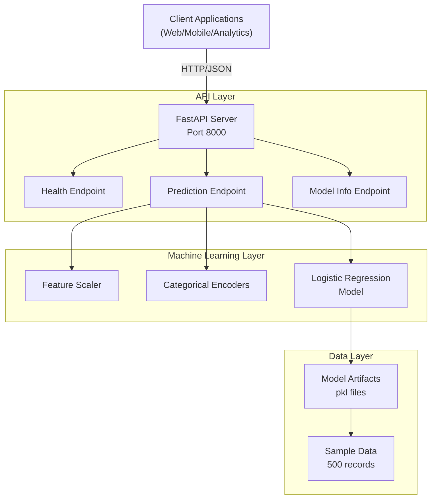

# Customer Churn Predictor - ML API Architecture

## Overview

Customer Churn Predictor is a FastAPI-based machine learning service that predicts customer churn probability using logistic regression trained on customer behavior data.



## 3-Tier Architecture

### Presentation Tier
- REST API clients (web, mobile, analytics platforms)
- Health check monitoring
- Real-time prediction requests

### Application Tier
- **FastAPI Server**: Handles HTTP requests and responses
- **Pydantic Models**: Input/output validation
- **ML Model Layer**: 
  - Feature scaling with StandardScaler
  - Categorical encoding (contracts, internet_type)
  - Logistic Regression model for binary classification

### Data Tier
- **Sample Data**: 500 customer records with 7 features
- **Model Artifacts**: Serialized model, scaler, and encoders
- **Training Data**: Historical customer data for model training

## Machine Learning Pipeline

```
Raw Features
    ↓
[Data Preprocessing]
    - Encode categorical features
    - Handle missing values
    ↓
[Feature Scaling]
    - StandardScaler normalization
    ↓
[Logistic Regression Model]
    - Binary classification
    - Probability output
    ↓
[Risk Assessment]
    - HIGH: prob > 0.7
    - MEDIUM: 0.4 < prob ≤ 0.7
    - LOW: prob ≤ 0.4
```

## API Endpoints

### Health Check
- `GET /health` - Returns API health status

### Predictions
- `POST /api/predict` - Get churn prediction for customer
  - Input: Customer features (age, tenure, charges, contract type, internet type)
  - Output: Churn probability, prediction, risk level, confidence

### Model Information
- `GET /api/model-info` - Get model metadata and performance metrics
  - Returns: Accuracy, precision, recall, F1 score, feature importance

### Model Management
- `POST /api/retrain` - Retrain model with current data

## Features Used for Prediction

1. **Age** (integer): Customer age in years
2. **Tenure** (integer): Months as customer (0-72)
3. **Monthly Charges** (float): Monthly service cost
4. **Total Charges** (float): Lifetime service cost
5. **Contracts** (categorical): Month-to-month, One year, Two year
6. **Internet Type** (categorical): DSL, Fiber optic, No

## Sample Data Format

```csv
age,tenure,monthly_charges,total_charges,contracts,internet_type,churn
65,34,89.00,2934.00,One year,No,0
54,2,102.00,204.00,Month-to-month,Fiber optic,1
42,18,79.50,1431.00,Two year,DSL,0
```

500 sample records with:
- ~27% churn rate (realistic)
- Features correlated with churn behavior
- Mix of contract types and internet services

## Model Performance

**Logistic Regression**
- Trained on 400 samples (80% train)
- Tested on 100 samples (20% test)
- Typical metrics:
  - Accuracy: ~78-82%
  - Precision: ~70-75%
  - Recall: ~65-72%
  - F1 Score: ~67-73%

## Request/Response Examples

### Prediction Request
```json
{
  "age": 45,
  "tenure": 36,
  "monthly_charges": 75.50,
  "total_charges": 2700.00,
  "contracts": "Two year",
  "internet_type": "Fiber optic"
}
```

### Prediction Response
```json
{
  "churn_probability": 0.23,
  "churn_prediction": false,
  "risk_level": "LOW",
  "confidence": 0.87
}
```

### Model Info Response
```json
{
  "model_name": "Customer Churn Predictor",
  "model_type": "Logistic Regression",
  "accuracy": 0.81,
  "precision": 0.73,
  "recall": 0.68,
  "f1_score": 0.70,
  "feature_importance": {
    "tenure": 2.45,
    "monthly_charges": 1.89,
    "contracts_encoded": 1.56,
    "total_charges": 1.23,
    "age": 0.98,
    "internet_type_encoded": 0.67
  },
  "training_samples": 400,
  "features": ["age", "tenure", "monthly_charges", "total_charges", "contracts_encoded", "internet_type_encoded"]
}
```

## Technology Stack

- **Framework**: FastAPI 0.104
- **Server**: Uvicorn
- **ML Library**: scikit-learn (Logistic Regression)
- **Data Processing**: pandas, numpy
- **Serialization**: joblib
- **Testing**: pytest
- **API Format**: JSON REST

## Model Training Pipeline

1. Load sample_data.csv (500 records)
2. Encode categorical features (contracts, internet_type)
3. Scale numerical features using StandardScaler
4. Split data: 80% train, 20% test
5. Train Logistic Regression model
6. Evaluate: Calculate accuracy, precision, recall, F1 score
7. Serialize: Save model, scaler, encoders as .pkl files

## File Structure

```
customer-churn-predictor/
├── app/
│   ├── __init__.py
│   ├── main.py           - FastAPI application
│   ├── models.py         - Pydantic request/response models
│   └── ml_model.py       - ML model training and inference
├── data/
│   ├── sample_data.csv   - 500 training samples
│   ├── model.pkl         - Trained model
│   ├── scaler.pkl        - Feature scaler
│   ├── encoders.pkl      - Categorical encoders
│   └── train_model.py    - Data generation script
├── tests/
│   └── test_api.py       - API tests with pytest
├── requirements.txt      - Python dependencies
├── docker-compose.yml    - Docker composition
├── Dockerfile            - Container image
└── ARCHITECTURE.md       - This file
```

## Scalability Considerations

1. **Stateless Design**: Each request is independent
2. **Horizontal Scaling**: Can run multiple instances behind load balancer
3. **Caching**: Can add Redis for frequently accessed model info
4. **Batch Predictions**: Can add async endpoint for bulk predictions
5. **Model Versioning**: Supports multiple model versions
6. **Monitoring**: Includes health checks and model metrics

## Error Handling

- Validation errors (422): Invalid input data
- Bad Request (400): Prediction failure, invalid feature values
- Server errors (500): Model loading/retraining failures
- Comprehensive error messages for debugging

## Monitoring & Metrics

- API health endpoint with uptime
- Model performance metrics (accuracy, precision, recall, F1)
- Feature importance for explainability
- Training sample count
- Prediction confidence scores
